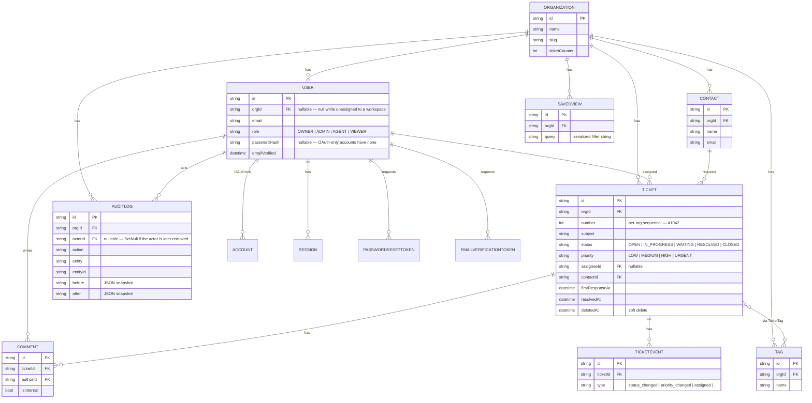

# architecture.md

## Overview

Deskly is a multi-tenant helpdesk. "Multi-tenant" means every row of domain data belongs to
exactly one `Organization`, and the application must guarantee that a user in one organization
can never read or write another's data — that guarantee is the single most important property
in the whole system, and it's the one thing covered by an integration test rather than just code
review (`test/integration/tenant-isolation.test.ts`).

## Data model



`Tag`/`TicketTag` and `SavedView` are modeled in the schema (the relations exist and are
migrated) but don't have UI wired up yet — see the Roadmap in the README.

## Tenancy enforcement

Every domain query goes through `src/lib/dal/` (the data-access layer). Each function there
takes an `orgId` as an explicit, required parameter and threads it into the Prisma `where`
clause — there is no query in the DAL that reads domain data without one. The pattern used
everywhere a single record is fetched by id is:

```ts
prisma.ticket.findFirst({ where: { id: ticketId, orgId } });
```

not `findUnique({ where: { id: ticketId } })` — the id alone is never sufficient. Get the `orgId`
wrong (or omit it) and the query returns nothing rather than another tenant's row. This is
exercised directly by the integration test, which seeds two organizations and asserts a lookup
scoped to org A returns `null` for an id that genuinely exists — just under org B.

## Auth & authorization

Sessions are JWT-based (Auth.js v5, `session.strategy: "jwt"`), signed and stored in an
`httpOnly` cookie — never readable from client JavaScript. Credentials sign-in verifies a
bcrypt hash (cost 12); Google/GitHub OAuth are wired through Auth.js and only appear as sign-in
options when their environment variables are actually set. `src/proxy.ts` (Next 16's renamed
`middleware.ts`) does a fast, cookie-presence check to redirect unauthenticated visitors away
from the app and authenticated visitors away from the auth pages — that's a UX convenience, not
the security boundary.

The real boundary is `can({ role }, action)` (`src/lib/auth/permissions.ts`), called inside
every server action, independently of whatever the UI already hid. Role is re-derived from the
signed session on every call — never trusted from the request body. Four roles, one rule that
matters most: only an **Owner** can grant **Owner** or **Admin**; everyone else caps at
Agent/Viewer. A second rule guards the org itself: the last remaining Owner can never be
demoted or removed (`countOwners()` check in `settings/members/actions.ts`), so a workspace can
never end up with zero people able to manage it.

## Request flow (a typical mutation)

```
Client Component (form)
  → Server Action ("use server")
      → getTenant() / requireOrg()      — resolve { user, orgId } from the session
      → can({ role }, action)            — authorize, or return { ok: false }
      → schema.safeParse(input)          — the same Zod schema the client-side form used
      → prisma.<model>.<op>({ orgId })   — org-scoped write
      → writeAuditLog({ ... })           — immutable trail
      → revalidatePath(...)              — Next.js cache invalidation
      → return { ok: true, data }
```

## Non-obvious decisions

- **SQLite via a driver adapter, in dev and production alike.** Prisma 7's driver-adapter
  architecture means the same schema and the same `PrismaClient` construction work against a
  local file (`file:./dev.db`) and a remote Turso database (`libsql://...`) — the only thing
  that changes between environments is the connection string. This keeps local development
  genuinely zero-setup (no Docker, no Postgres install) while still being production-durable.
  See `docs/decisions.md` for the full trade-off discussion, including the Postgres alternative.
- **Enums as string unions, not Prisma native enums.** SQLite has no native enum type, so
  `Role`, `TicketStatus`, `TicketPriority`, and `AuditAction` are `as const` string tuples in
  `src/lib/constants/enums.ts`, validated by a matching Zod schema at every boundary. This is
  also what keeps the schema portable to Postgres later without a migration rewrite.
- **Removal detaches, it doesn't delete.** `Comment.author` has `onDelete: Cascade` — hard-deleting
  a removed member would silently destroy every comment they ever wrote. Removing a member
  instead sets `User.orgId = null`, ending their access while their comments, ticket
  assignments, and audit history stay intact.
