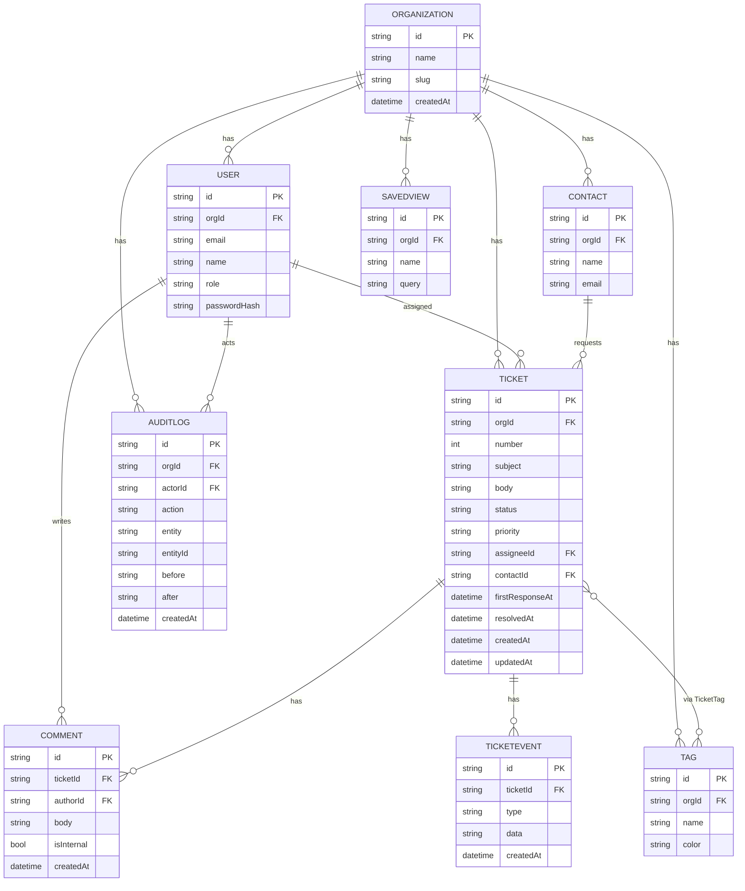

# plan.md — Product & Engineering Plan for Deskly

> Written **before** code (STEP 4). Covers user stories, acceptance criteria, edge cases,
> data model, ER diagram, permissions matrix, API plan, folder structure, milestones, risks.

---

## 1. Product in one line

**Deskly** is a modern helpdesk where support teams triage, assign, and resolve customer
tickets — with the analytics, RBAC, and polish of a real SaaS product.

Personas:
- **Owner** — founder/lead; full control incl. billing/settings/member roles.
- **Admin** — manages members, tags, org settings; full ticket powers.
- **Agent** — works tickets: create, reply, assign (self), change status/priority.

---

## 2. User stories & acceptance criteria

### Auth
- **US-1** As a user I can sign in with email/password so my workspace is secure.
  - AC: invalid creds → generic error; valid → redirect to `/dashboard`; session persists on refresh; sign-out clears session.
  - AC: unauthenticated access to any `/(app)` route → redirect to `/login?callbackUrl=…`.

### Tickets (CRUD — core)
- **US-2** As an agent I can create a ticket (subject, description, contact, priority, tags).
  - AC: server + client Zod validation; subject required (3–140 chars); optimistic add; audit entry written.
- **US-3** As an agent I can view a ticket with its full activity timeline and threaded comments.
  - AC: public replies vs internal notes visually distinct; timeline shows status/assignment/priority changes.
- **US-4** As an agent I can update status, priority, assignee inline.
  - AC: optimistic update + rollback on error; audit entry with before→after.
- **US-5** As an admin/owner I can delete a ticket.
  - AC: agents cannot delete (403 server-side, hidden in UI); confirm dialog; soft context in audit log.

### Browse / find
- **US-6** As an agent I can search, filter, sort, and paginate the ticket list.
  - AC: state lives in the URL (shareable); filters combine (AND); empty result → empty state; page size 10/25/50.
- **US-7** As an agent I can save a filter as a named view.
  - AC: saved views appear in sidebar; scoped to org.

### Analytics
- **US-8** As an admin I can see a dashboard of KPIs and trends.
  - AC: open tickets, resolved (7d), avg first-response, resolution rate; volume line, status donut, priority bars, agent leaderboard; all org-scoped.

### Exports
- **US-9** As an agent I can export the current filtered tickets to CSV.
- **US-10** As an agent I can export a ticket (or dashboard report) to PDF.
  - AC: CSV respects active filters/sort; PDF renders server-side, downloads with a sensible filename.

### Admin / settings
- **US-11** As an owner/admin I can invite/manage members and change roles.
  - AC: only Owner can assign Owner/Admin; last Owner cannot be demoted; agents can't reach `/settings/members`.
- **US-12** As any user I can edit my profile and change my password.
- **US-13** As an admin I can review the org audit log with filters.

---

## 3. Edge cases (designed for, tested where critical)

- Cross-tenant access attempt (org B id in org A session) → 404 via DAL scoping. **(security-critical, E2E/integration test)**
- Deleting the last Owner / demoting the last Owner → blocked with clear error.
- Assigning a ticket to a member of another org → rejected.
- Concurrent status edits → last-write-wins + audit trail preserves both.
- Export of 0 rows → valid empty CSV / "nothing to export" toast.
- Very long subject/description → truncation in table, full in detail; server length caps.
- Pagination past last page (manual URL) → clamps to last page.
- XSS in ticket body / comment → escaped on render (React) + sanitised where HTML allowed.
- Rate-limit tripped on login → 429 with retry-after, generic message.
- Dark-mode flash on first paint → blocked via inline theme script.
- Time zones → store UTC, render in user locale.

---

## 4. Data model (entities & relationships)

- **Organization** 1—* **User**, 1—* **Contact**, 1—* **Ticket**, 1—* **Tag**, 1—* **AuditLog**, 1—* **SavedView**
- **User** (role: OWNER|ADMIN|AGENT) 1—* **Ticket** (as assignee, nullable), 1—* **Comment**, 1—* **AuditLog** (actor)
- **Contact** (the customer) 1—* **Ticket** (as requester)
- **Ticket** 1—* **Comment**, *—* **Tag** (via **TicketTag**), 1—* **TicketEvent** (timeline)
- **Comment** belongs to Ticket + author User; `isInternal` flag
- **AuditLog** — actor, action, entity type+id, before/after JSON, createdAt
- Enums modelled as **string unions + Zod** (SQLite-portable): `Role`, `TicketStatus`, `TicketPriority`, `AuditAction`.

### ER diagram



---

## 5. Permissions matrix (RBAC)

| Action | Owner | Admin | Agent |
|---|:---:|:---:|:---:|
| View tickets/dashboard | ✅ | ✅ | ✅ |
| Create ticket / comment | ✅ | ✅ | ✅ |
| Update ticket (status/priority/assignee) | ✅ | ✅ | ✅ |
| Delete ticket | ✅ | ✅ | ❌ |
| Manage tags | ✅ | ✅ | ❌ |
| View audit log | ✅ | ✅ | ❌ |
| Manage members (invite/remove) | ✅ | ✅ | ❌ |
| Assign OWNER/ADMIN role | ✅ | ❌ | ❌ |
| Edit org settings | ✅ | ✅ | ❌ |
| Export CSV/PDF | ✅ | ✅ | ✅ |
| Edit own profile | ✅ | ✅ | ✅ |

Enforcement: a single `can(user, action, resource?)` policy function in `lib/auth/permissions.ts`,
called by both UI (to hide controls) and server (to authorize) — **server is the source of truth**.

---

## 6. API plan

**Mutations → Server Actions** (`app/(app)/**/actions.ts`), each: `authz → Zod parse → DAL → audit → revalidate`.

**Route Handlers** (`app/api/**`) for programmatic/REST + exports:

| Method | Path | Purpose | Auth |
|---|---|---|---|
| `GET` | `/api/tickets` | list (query: q, status, priority, assignee, tag, sort, page, pageSize) | session |
| `POST` | `/api/tickets` | create | session + can:create |
| `GET` | `/api/tickets/:id` | detail | session + tenant |
| `PATCH` | `/api/tickets/:id` | update | session + can:update |
| `DELETE` | `/api/tickets/:id` | delete | session + can:delete |
| `GET` | `/api/tickets/export` | CSV of filtered set | session |
| `GET` | `/api/tickets/:id/pdf` | ticket PDF | session + tenant |
| `GET` | `/api/analytics/summary` | dashboard aggregates | session |
| `POST` | `/api/auth/[...nextauth]` | Auth.js | — |

All responses: typed envelope `{ ok: true, data } | { ok: false, error }`. Zod-validated inputs. Rate-limited writes/exports/auth.

---

## 7. Folder structure (feature-oriented)

```
deskly/
├─ app/
│  ├─ (marketing)/            # public landing + SEO
│  ├─ (auth)/login/           # auth screens
│  ├─ (app)/                  # authenticated app shell (sidebar)
│  │  ├─ dashboard/
│  │  ├─ tickets/ [id]/
│  │  ├─ contacts/
│  │  ├─ settings/ (profile|members|org|audit)
│  ├─ api/                    # route handlers
│  ├─ layout.tsx  robots.ts  sitemap.ts  manifest.ts
├─ components/
│  ├─ ui/                     # shadcn primitives
│  ├─ app-shell/              # sidebar, topbar, command palette
│  ├─ tickets/  dashboard/  data-table/   # feature components
├─ lib/
│  ├─ auth/      (config, permissions, session)
│  ├─ dal/       (org-scoped data access — the tenancy boundary)
│  ├─ validations/  (Zod schemas — shared client+server)
│  ├─ constants/ (enums as unions)
│  ├─ export/    (csv, pdf)
│  ├─ utils/     (cn, dates, formatting, rate-limit)
├─ prisma/       (schema.prisma, seed.ts, migrations)
├─ hooks/        (useDebounce, useTableParams, useOptimistic*)
├─ test/         (unit, integration, setup)
├─ e2e/          (Playwright specs)
├─ docs/  SUBMISSION/  .github/
```

---

## 8. Milestones → see PROJECT_STATE.md §3 (M0–M10).

## 9. Risks & mitigations

| Risk | Impact | Mitigation |
|---|---|---|
| Scope is very large for a trial | Incomplete features | Milestones + PROJECT_STATE; ship vertical slices that fully work |
| SQLite↔Postgres drift | Prod deploy breaks | No native enums/JSON-specific ops; test build; document switch |
| Tenant data leakage | Security fail | Central DAL; integration + E2E test cross-tenant |
| PDF/CSV on serverless | Export fails on Vercel | Use pure-JS libs (no headless browser) — `@react-pdf` / manual CSV |
| Dark-mode FOUC | Polish ding | Inline pre-hydration theme script |
| `any` creeping in | Code-quality ding | `strict` + `noImplicitAny` + lint rule ban on `any` |
| Rate-limit needs Redis | Infra dependency | In-memory limiter for dev; documented Upstash swap for prod |
